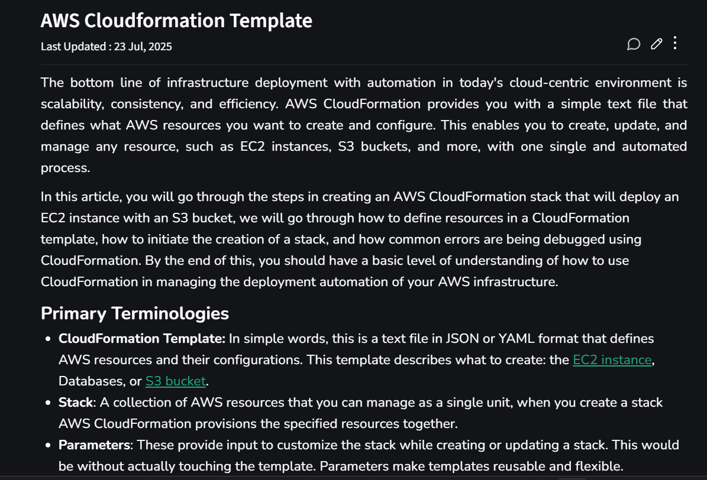

# Day 104 –Learning how to make cloud formation Templates 

## AWS CloudFormation Template – Summary & Steps

## Summary  
AWS CloudFormation is an Infrastructure as Code (IaC) service that allows you to define and manage AWS resources using a template file (JSON/YAML). It helps automate infrastructure deployment, ensuring consistency, scalability, and repeatability.

Instead of manually creating resources like EC2 or S3, you define everything in a template and deploy it as a **stack**, which CloudFormation manages automatically.

---

## Steps to Create a CloudFormation Stack  

1. **Create a Template**
   - Write a YAML/JSON file  
   - Define AWS resources (EC2, S3, etc.)  
   - Specify configurations and dependencies  

2. **Define Resources**
   - Add services inside the `Resources` section  
   - Configure properties (instance type, bucket name, etc.)  

3. **Validate the Template**
   - Check syntax and structure before deployment  

4. **Create a Stack**
   - Upload template in AWS CloudFormation  
   - Provide stack name and parameters  
   - Launch stack  

5. **Provisioning of Resources**
   - CloudFormation automatically creates resources  
   - Handles dependencies in correct order  

6. **Monitor Stack Creation**
   - Track progress via events/logs  
   - Identify errors if any  

7. **Debug Errors**
   - Check failure events  
   - Fix template issues and re-deploy  

8. **Update Stack**
   - Modify template  
   - Apply changes without recreating everything  

9. **Delete Stack**
   - Remove all resources together when no longer needed  

---

## Key Idea  
CloudFormation enables **automated, repeatable, and version-controlled infrastructure deployment**, reducing manual effort and human error.