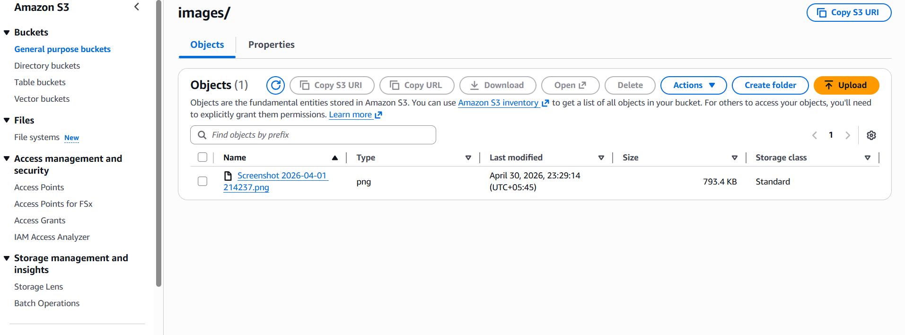
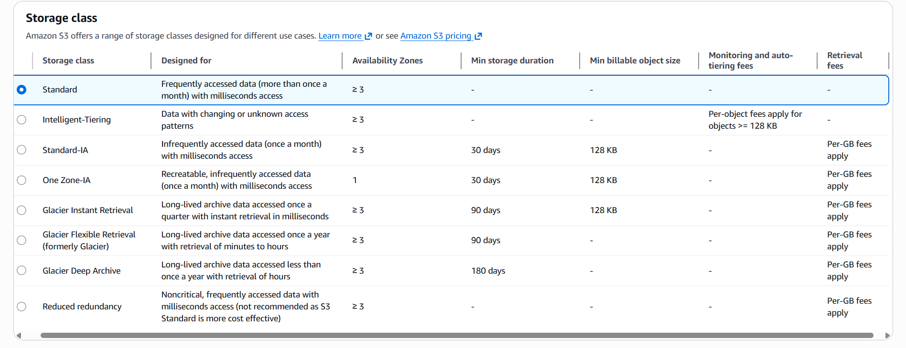

# Day17 of Learning for change 
#111DaysOfLearningForChange

Today I focused on strengthening my practical understanding by working on lab exercises and exploring Amazon S3 in the AWS Console in more depth. I spent time understanding how storage buckets are structured, how objects are managed, and how permissions and access control work in real scenarios. Alongside that, I practiced multiple-choice questions to reinforce key concepts and test my understanding. Overall, it was a balanced day of hands-on learning and revision, helping me build more confidence in AWS fundamentals.

