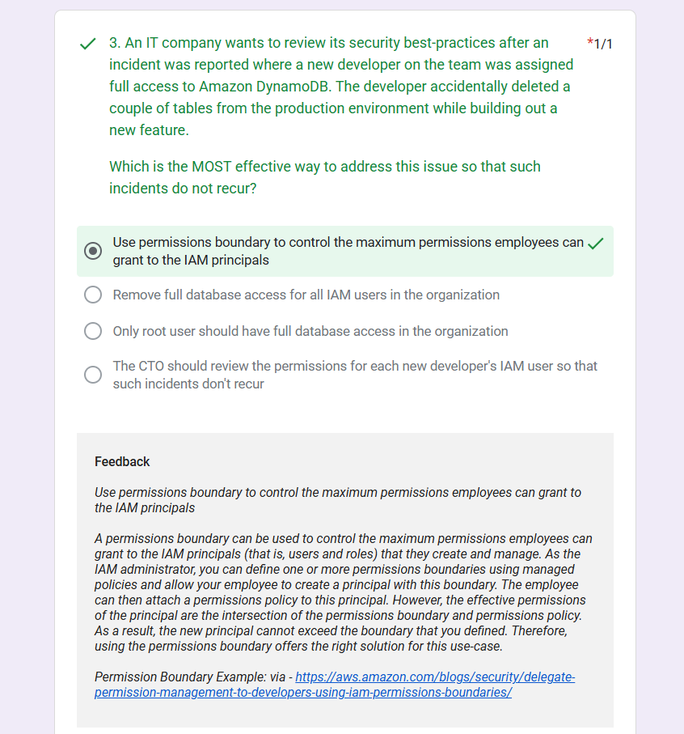
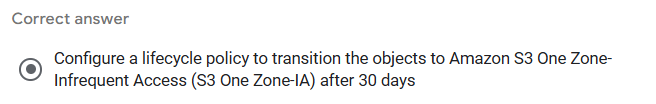

# Day18 of Learning for change 
#111DaysOfLearningForChange

Today, I practice some of the questions, I got half of them correct, and half of them wrong. So I practive the concepts I get wrong and why?

2. A media agency stores its re-creatable assets on Amazon Simple Storage Service (Amazon S3) buckets. The assets are accessed by a large number of users for the first few days and the frequency of access falls down drastically after a week. Although the assets would be accessed occasionally after the first week, but they must continue to be immediately accessible when required. The cost of maintaining all the assets on Amazon S3 storage is turning out to be very expensive and the agency is looking at reducing costs as much as possible.

* As an AWS Certified Solutions Architect – Associate, can you suggest a way to lower the storage costs while fulfilling the business requirements?

* Configure a lifecycle policy to transition the objects to Amazon S3 Standard-Infrequent Access (S3 Standard-IA) after 30 days
Configure a lifecycle policy to transition the objects to Amazon S3 One Zone-Infrequent Access (S3 One Zone-IA) after 7 days
 
* Configure a lifecycle policy to transition the objects to Amazon S3 One Zone-Infrequent Access (S3 One Zone-IA) after 30 days

* Configure a lifecycle policy to transition the objects to Amazon S3 Standard-Infrequent Access (S3 Standard-IA) after 7 days

> MY Answer 

Why wrong cause 