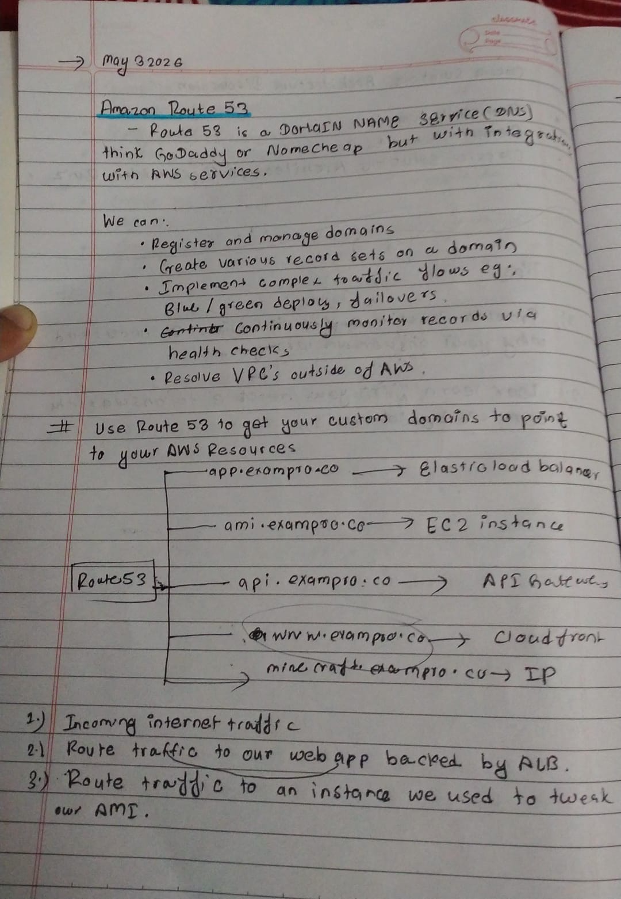
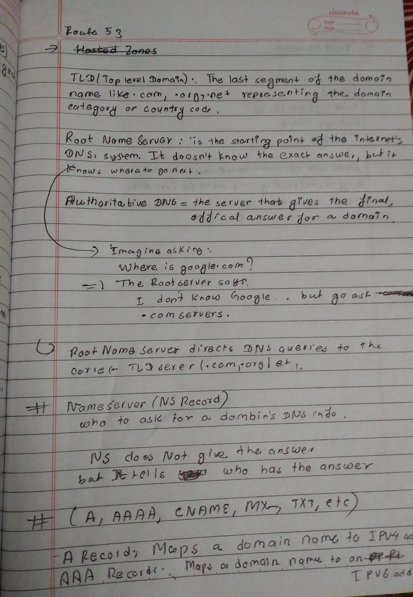

# Day20 of Learning for change 
#111DaysOfLearningForChange

Today I Learned about Amazon Route 53 

>Route 53 is a highly availabe and scalable Domain Name System(DNS) web service provided by AWS. 

It performs 3 Majors functions:
* Domain Registration: Route 53  allows to register and manage domain names for websites and apps.

* DNS Routing: Translates domain names (like example.com) into IP addresses, directing users to resources such as AWS services or external endpoints.

* Health Checking: Monitors the health and availability of endpoints, automatically routing traffic away from unhealthy targets.

