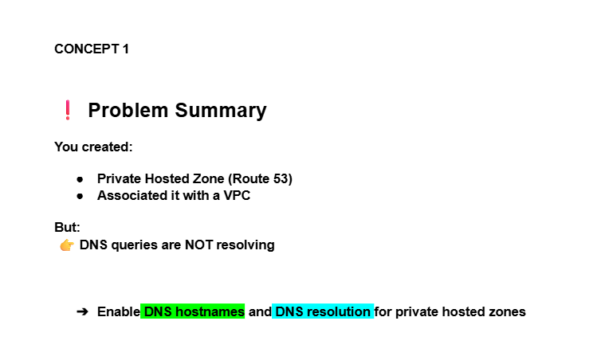
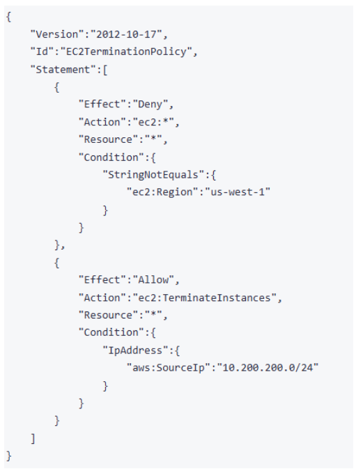
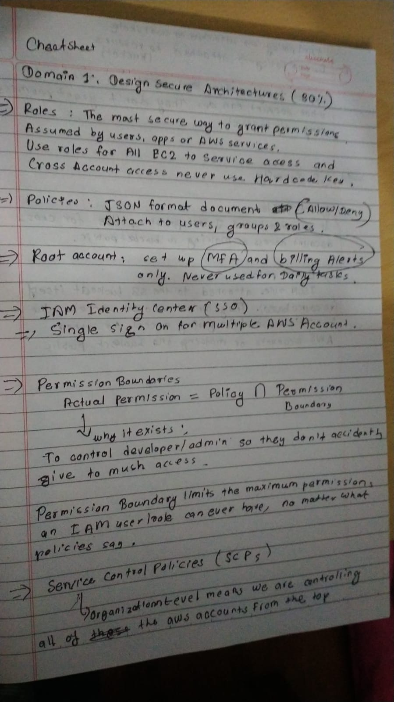
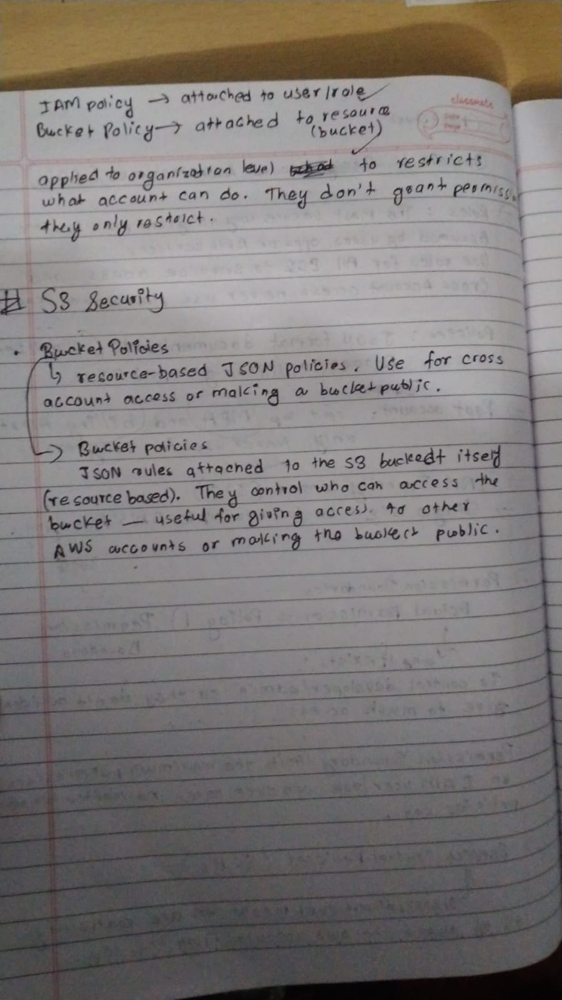

# Day21 of Learning for change 
#111DaysOfLearningForChange

Today I revised concepts and practice in a exam oriented way. 
* Question 1: DNS queries not resolving 

* Question 2: EC2 Termination Policy 

**❌ Statement 1 (DENY)**

There is written StringNotEquals means deny in all the regions except us-west-1.

**✅ Statement 2 (ALLOW)**

Allow terminate instances
ONLY if request comes from IP range 10.200.200.0/24

* Question 3: The group would like to minimize the application boostrap time whenever the system needs to be stopped and then started at a later point in time.

App takes 3 minutes to initialize every restart

We want fast resume after stop/start

> Need fast restart with same running state → Use Hibernate(hibernate is like sleep mode of computer everything doesn't start from the scrath)

  
  

