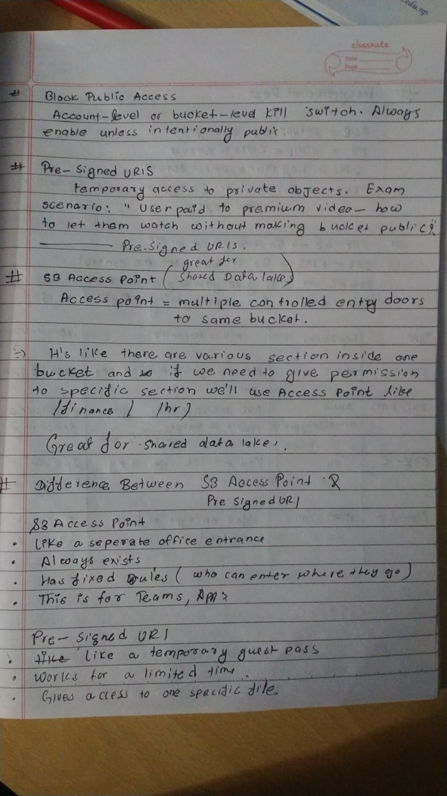
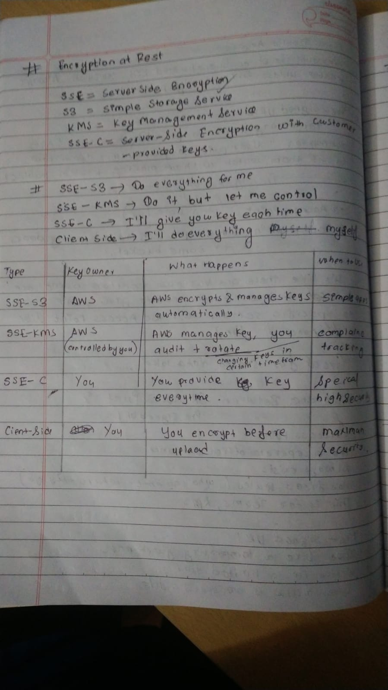
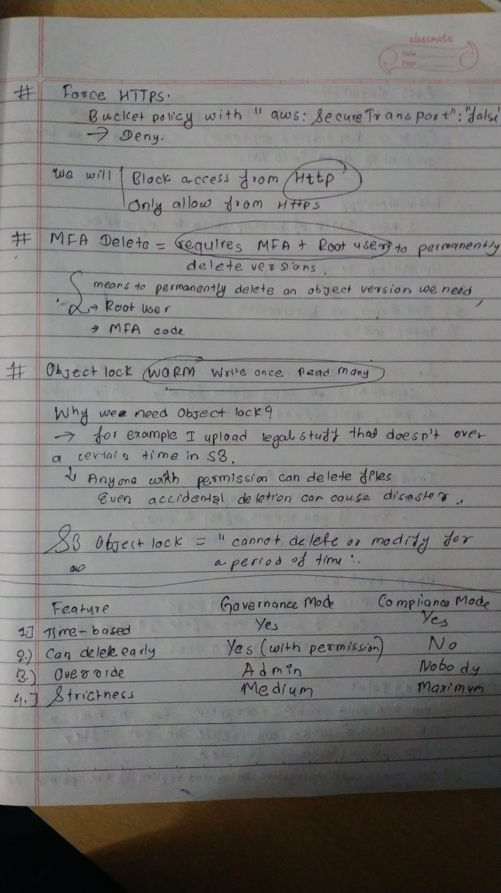

# Day22 of Learning for change 
#111DaysOfLearningForChange

Today I studied:
* Pre-Signed URls
* S3 Access Point 
* Difference Between S3 Access point and Pre-Signed Urls 
* Encryption at Rest 
     * SSE-S3: Server Side Encryption- Simple Storage Service 
     * SSE-KMS: Server Side Encryption: Key management System 
     * SSE-C: Server Side Encryption with client provided keys
     * Client Side-Fully managed by user only stored in S3 

  
  
  

