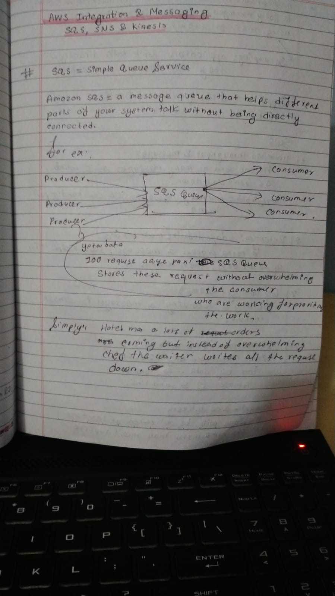
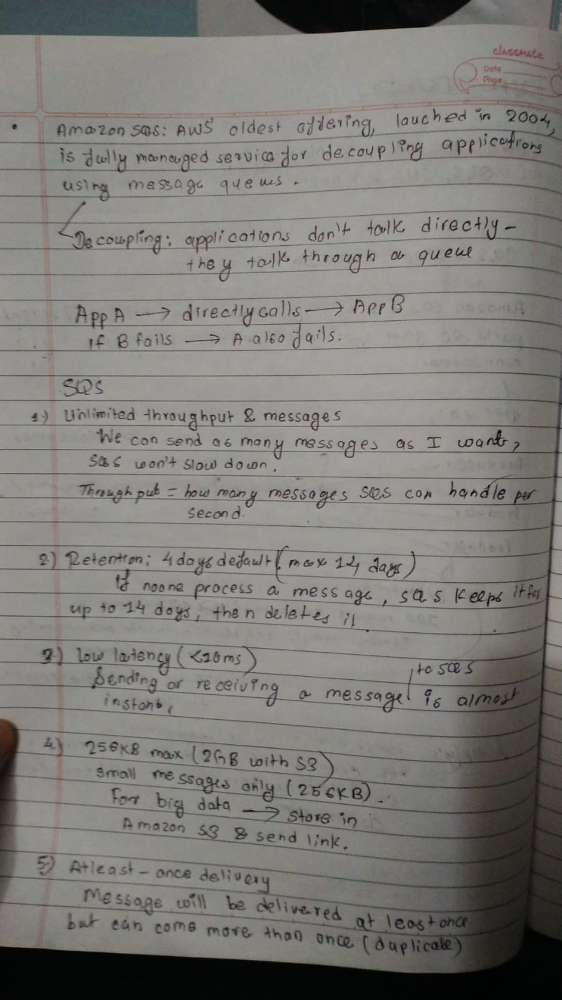
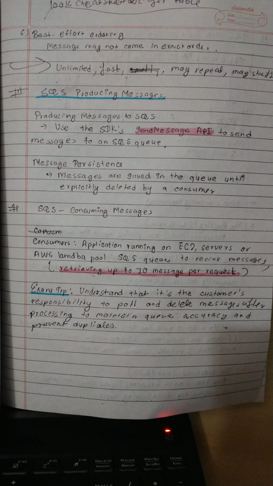
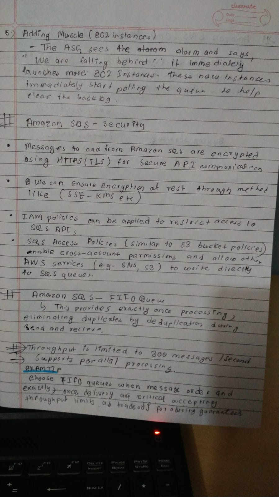

# Day23 of Learning for change 
#111DaysOfLearningForChange

Today, I studied about, 

**SQS Simple Queue Service**

SQS is a message queue that helps different parts of your system talk without being directly connected. 

  
  
  

  
  

