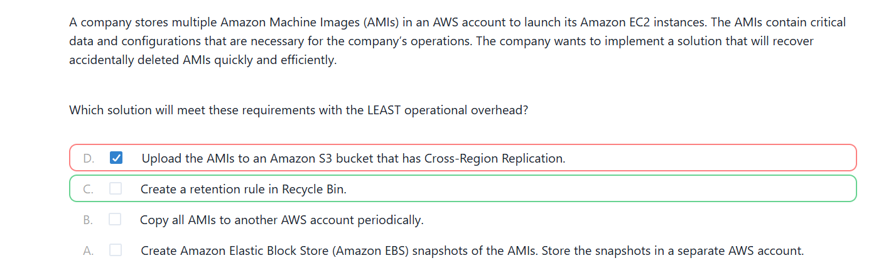
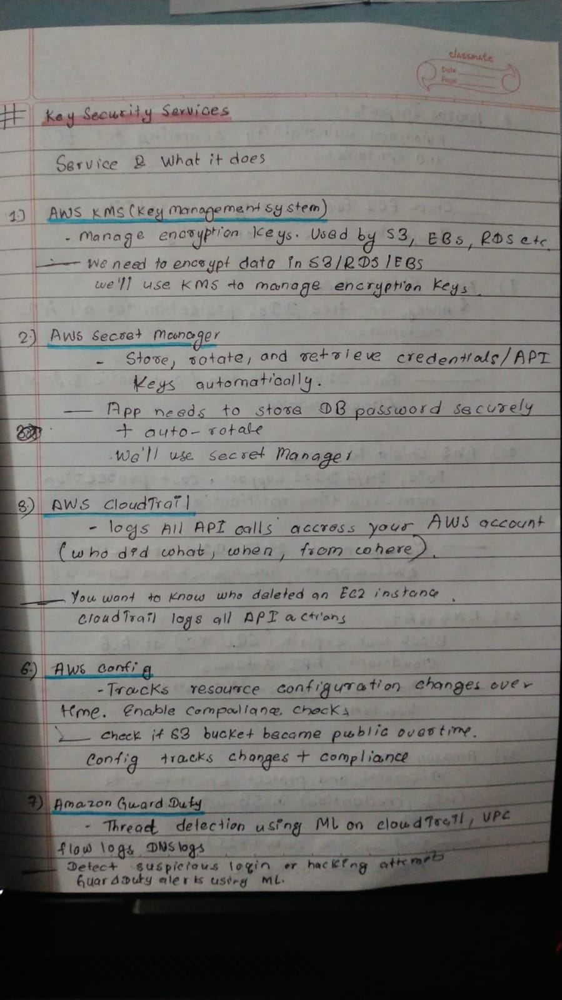
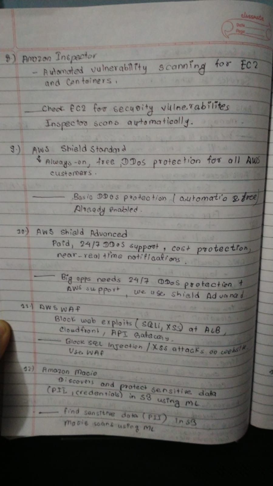
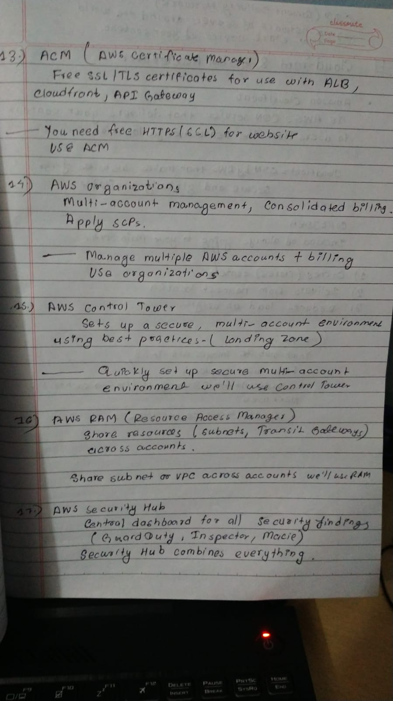

# Day24 of Learning for change 
#111DaysOfLearningForChange

Today I studied Key Security Services, 
* AWS KMS(key Management System)
* AWS Secret Manager 
* AWS CLoudTrail
* AWS Config 
* Amazon Guard Duty 
* Amazon Inspector and lot more 

I also practice some mcqs question, 

  
  
  

