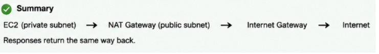

# Day26 of Learning for change 
#111DaysOfLearningForChange

NETWORKING 

1. NAT GATEWAY 
-> A bridge that lets private EC2 instances go OUT to the internet, but blocks anything from coming IN. 

Only Outbound               No Inbound 

Provides high availability, automatic scaling & higher bandwidth
(5 -100 gbps)
Requires no user maintenance or Security group management
Created in a specific availability zone with an elastic ip assigned 

EXAM PATTERNS: 

1. Amazon EC2 in private subnet needs software updates and API calls to internet 
private subnet needs internet -> no public IP allowed→ NAT Gateway 

2. Private EC2 needs OS/software updates → use NAT Gateway.
 

TRAP 

AWS separates 
Internet Traffic 
AWS Internal Traffic 

If I need to update os, api calls and all I have to go to internet so we’ll use NAT Gateway 
If private EC2 needs to upload something to S3, read or write we’ll use VPC ENDPOINT not natgateway.
Many instances need internet without public IPs → use NAT Gateway instead of exposing them. 

Private EC2 cannot access internet → check/add NAT Gateway and route (0.0.0.0/0). 

