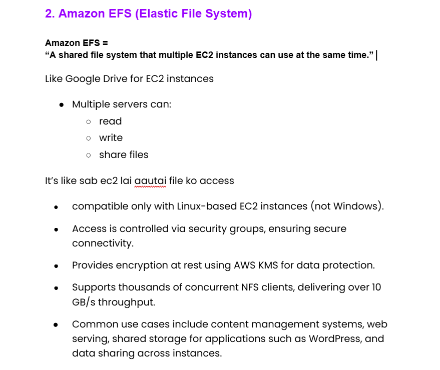

# Day28 of Learning for change 
#111DaysOfLearningForChange

Today I studied about Amazon EFS(Elastic File System)

**Amazon EFS – Elastic File System**

**Throughput Modes**

Bursting:
* Throughput scales with storage size. For example, 1 TB storage provides baseline 50 MiB/s throughput with bursts to 100 MiB/s.
* Used when throughput needs track storage size with occasional spikes.

**Provisioned:**
* Allows setting a fixed throughput level independent of storage size.
* Good for workloads with predictable, steady throughput needs (e.g., large media processing pipelines).

**Elastic (recommended):**
* Automatically scales throughput up or down based on workload demands.
* Supports up to several GiB/s (up to 3 GiB/s reads, 1 GiB/s writes).
Best for unpredictable or spiky workloads.
