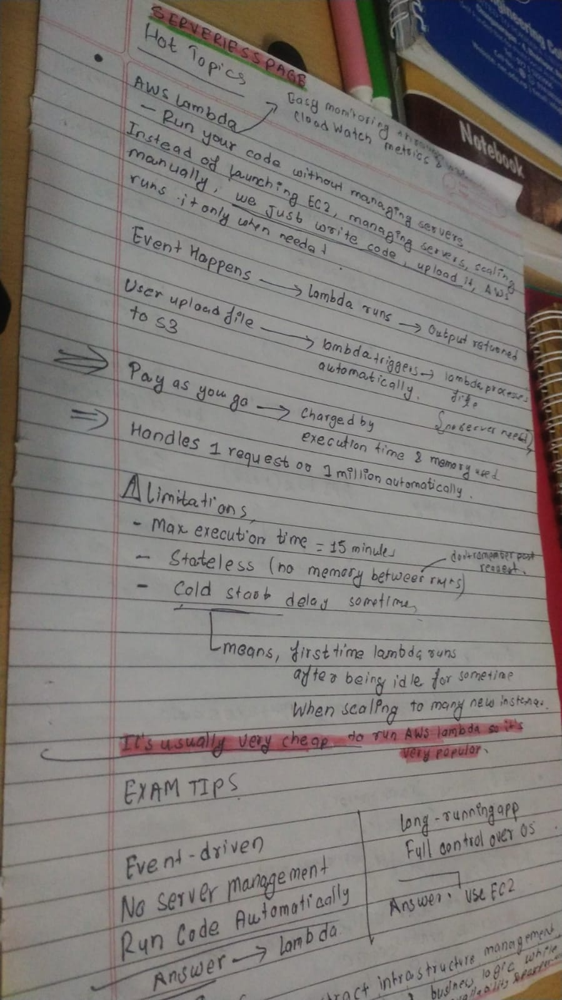
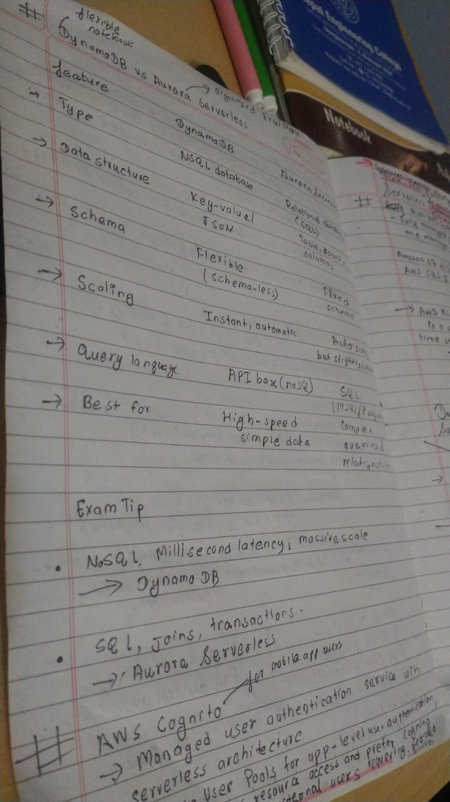
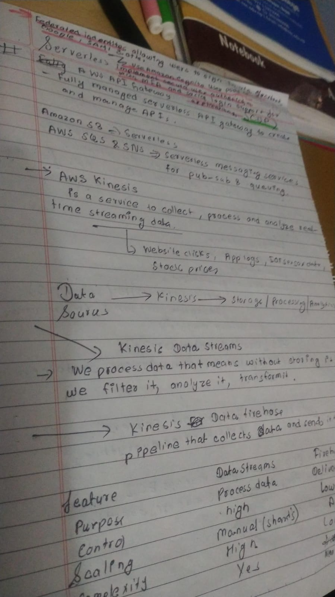

# Day31 of Learning for change  
#111DaysOfLearningForChange  

Today I learn about Serverless services in aws such as:
* AWS Lambda 
* DynamoDB
* Aurora Serverless 
* ECS 
* ECS Fargate 
* AWS Kinesis 
* Kinesis Data Streams 
* Kinesis Data Firehose

  
  
  

