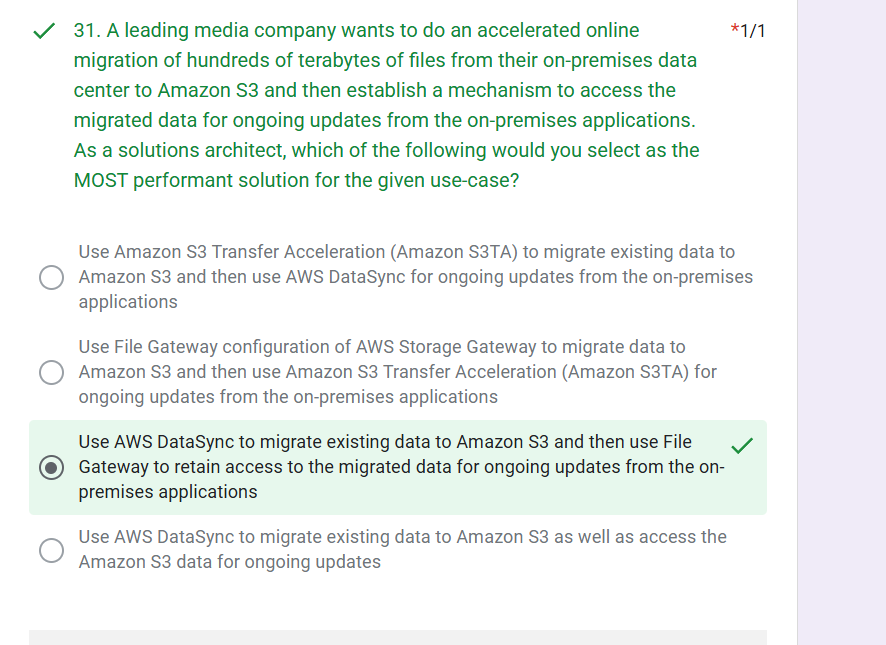

# Day34 of Learning for Change  
#111DaysOfLearningForChange  

Today I practice various scenarios questions : 

# AWS Cheat Sheet (Q44–64)

## Q44 – Instance Store vs EBS

If a question says very high performance but data can be lost, choose Instance Store. It is temporary storage attached to EC2 with the highest speed and lowest latency. All data is deleted when the instance stops or terminates. Use only for cache or temporary processing, not critical data.

## Q45 – AWS Global Accelerator

If users are global and need fast access to dynamic APIs, use Global Accelerator. It routes traffic through AWS global network using static IPs. It improves latency without caching content. Best for real-time or non-cacheable applications.

## Q46 – S3 File Gateway

If on-prem apps need fast access to S3, use S3 File Gateway. It caches frequently used data locally for low latency. Data is stored in S3 but accessed like a file system. Best for hybrid storage setups.

## Q47 – Site-to-Site VPN

If you need a quick and secure connection between on-prem and AWS, use Site-to-Site VPN. It uses IPSec over the internet with encryption. No physical setup is required. Best for fast deployment.

## Q48 – DynamoDB Global Tables

If an app serves global users with low latency writes, use Global Tables. It provides active-active replication across regions. Data is automatically synced. Best for globally distributed applications.

## Q49 – Internet Access Requirements

If EC2 cannot access the internet, check routing and security. Route table must point to Internet Gateway. NACL and security groups must allow traffic. All layers must be correctly configured.

## Q50 – ElastiCache Redis

If a question asks for very fast data access or caching, use Redis. It is in-memory and provides sub-millisecond latency. Reduces database load significantly. Used for real-time applications.

## Q51 – Session Management

If sessions must survive instance failure, avoid sticky sessions. Use Redis to store sessions centrally. This allows scaling across multiple servers. Improves reliability and fault tolerance.

## Q52 – S3 Lifecycle Policy

If data becomes less frequently used over time, use lifecycle policies. Automatically move data to cheaper storage like Standard-IA. Can also delete data after a period. Helps reduce storage cost.

## Q53 – S3 Intelligent-Tiering

If access patterns are unknown, use Intelligent-Tiering. It automatically moves data between tiers. No manual rules needed. Optimizes cost without operational effort.

## Q54 – S3 Object Lock

If data must never be deleted for compliance, use Object Lock. In compliance mode, even root cannot delete data. It enforces write-once-read-many. Used for legal requirements.

## Q55 – S3 + Lambda

If processing needs to happen on file upload, use S3 with Lambda. It triggers automatically when objects are added. Fully serverless and scalable. Common for image or data processing.

## Q56 – Transfer Acceleration

If users upload data from distant locations, use Transfer Acceleration. It uses edge locations for faster transfer. Improves speed over long distances. Best for global uploads.

## Q57 – AWS PrivateLink

If you need private access to services without internet, use PrivateLink. Traffic stays within AWS network. Provides high security and isolation. Ideal for SaaS or internal APIs.

## Q58 – Load Balancer Health Checks

If instances are unhealthy but not replaced, check health check type. ASG must use ALB health checks instead of EC2. Mismatch causes failure in replacement. Fix ensures proper scaling.

## Q59 – Kinesis Throughput Issue

If Kinesis shows throughput exceeded errors, check data sending pattern. Sending one record at a time causes throttling. Use batch processing instead. Improves performance and efficiency.

## Q60 – Auto Scaling High Availability

If high availability is required, distribute instances across AZs. Maintain minimum instances in each AZ. This protects against AZ failure. Ensures continuous availability.

## Q61 – EC2 Cost Optimization

If workload is predictable, use Reserved Instances. For variable load, use Spot Instances. Combining both gives cost efficiency and flexibility. Reduces overall expense.

## Q62 – RDS Disaster Recovery

If database must survive region failure, use cross-region replicas. Automated backups help with point-in-time recovery. Combines durability and availability. Essential for critical systems.

## Q63 – CloudFront vs Global Accelerator

If content is static and cacheable, use CloudFront. If traffic is dynamic, use Global Accelerator. CloudFront reduces latency using caching. Choose based on content type.

## Q64 – Architecture Summary

If designing systems, match service to problem type. Use Instance Store for temporary speed, Redis for caching, and Global Tables for global apps. Combine services based on need. Always align with performance, cost, and reliability goals.
