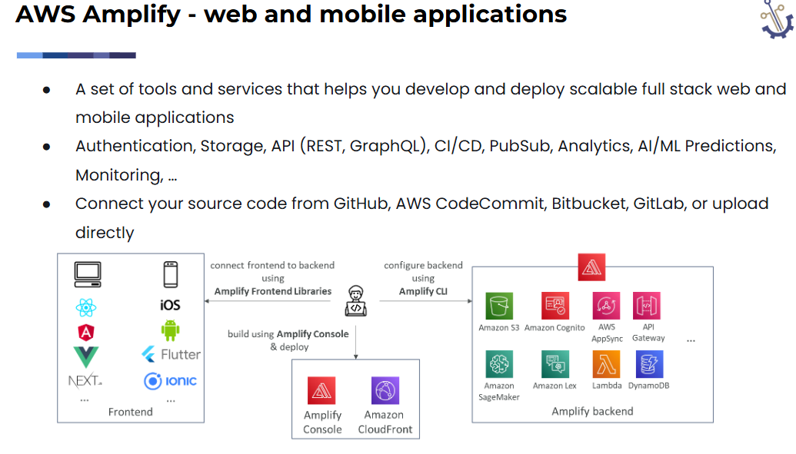

# Day35 of Learning for Change  
#111DaysOfLearningForChange  

* **Amazon SES(Simple Email Service)**

    -> is a fully managed service to send emails, securely, globally and at scale.

    Supports inbound/outbound emails

    Use cases: transactional, marketing and bulk email communications

    Reputation dashboard, performance insights, anti-spam feedback 

    Provides statistics such as email deliveries, bounces, feedback loop results, email open

* **Amazon Pinpoint**

    Scalable 2-way (outbound/inbound) marketing communications service

    Supports email, SMS, push, voice, and in-app messaging

    Use cases: run campaigns by sending marketing, bulk, transactional SMS messages

    Ability to segment and personalize messages with the right content to customers

    Possibility to receive replies

    Scales to billions of messages per day

    
* **AWS Amplify**

for eg: I have a project in my github, I can easliy deploy it in aws with the help of AWS Amplify. 

* **AWS CloudFormation**

Without CloudFormation, We 

* Buy bricks

* Hire workers

* Build each room manually

> Slow + error-prone 

**but with CloudFormation**

We give a blueprint to a builder, and they build the entire house for you.

> Fast + consistent + repeatable

AWS CloudFormation is a fully managed Infrastructure as Code (IaC) service that enables users to model, provision, and manage AWS resources using declarative templates.

Rather than manually creating resources through the AWS Management Console, CloudFormation allows you to define your infrastructure in code and deploy it in a predictable, repeatable, and automated manner.

# 🧩 Core Concepts

1. Templates

    CloudFormation uses templates (JSON or YAML) to describe the desired state of your infrastructure.

    A template typically defines:

    Resources (EC2, S3, RDS, etc.)
    Parameters (input values)
    Outputs (exported values)
    Mappings and Conditions (optional logic)

2. Stacks

    A stack is a collection of AWS resources created and managed as a single unit.

    Each stack is created from a template
    All resources in a stack are managed together
    Supports lifecycle operations like create, update, delete

3. Change Sets

    Change sets allow you to preview changes before applying them to a stack.

    > Helps reduce risk by showing:

    What will be added
    What will be modified
    What will be deleted

4. Drift Detection

    CloudFormation can detect configuration drift, which occurs when:

    Resources are modified outside CloudFormation

    > Ensures infrastructure consistency and governance