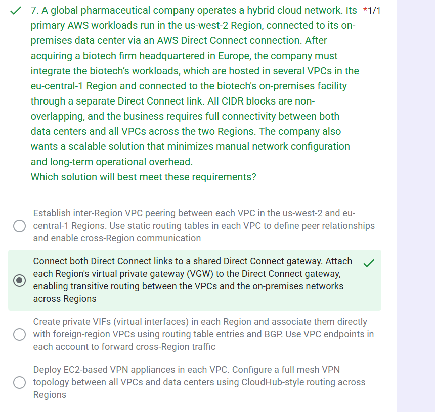
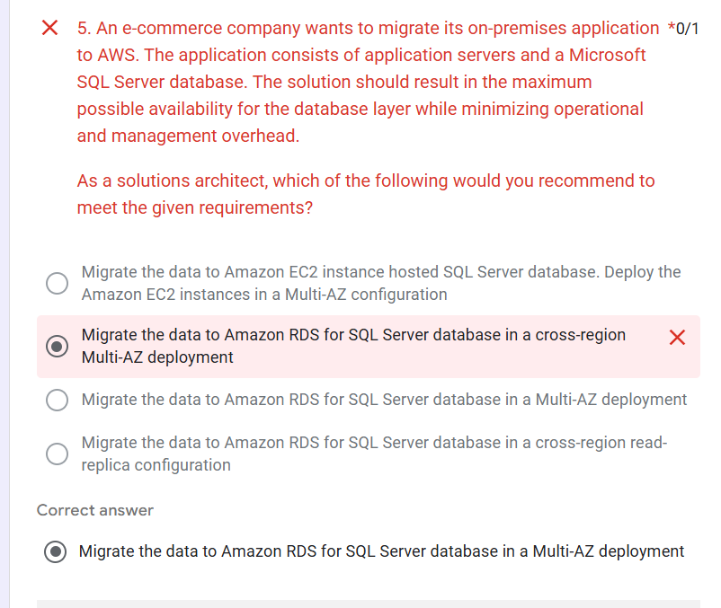

# Day 39: Core AWS Architecture Concepts

 Today, I practice questions and analyse the concept behind them. 

## Core Strategy for These Questions

* Scaling vs Performance vs Cost?
* Read-heavy vs Write-heavy?
* Static vs Dynamic workloads?
* High Availability vs Disaster Recovery?

---

## ⚡ Scaling & Performance

### Auto Scaling Group (ASG)

* Automatically scales EC2 instances
* Handles unpredictable traffic
* “traffic spike / dynamic workload” → ASG

### Predictive + Dynamic Scaling

* Predicts usage patterns (weekends, peaks)
* Combines with real-time scaling
* “forecast + real-time scaling” → Predictive + Target Tracking

### Kubernetes Scaling

* HPA → scales pods
* Cluster Autoscaler → scales nodes
* “pods not enough → need nodes” → Cluster Autoscaler

---

## 🧠 Caching & Performance Optimization

### API Gateway Caching

* Reduces backend load
* Great for read-heavy workloads
* “same data, rarely changes” → Cache

### DynamoDB DAX

* In-memory cache for DynamoDB
* Fixes hot partition issues
* “high read + hot key” → DAX

---

## 🗄️ Database Selection

### Amazon DynamoDB

* Serverless NoSQL
* Single-digit ms latency
* “high scale + low latency” → DynamoDB

### Amazon Neptune

* Graph database
* Relationship queries
* “friends of friends / connections” → Neptune

### Amazon RDS Read Replicas

* Scale read traffic
* “read-heavy relational DB” → Read Replica

---

## 🌐 Networking & Routing

### Route 53 Routing

* Geoproximity → shift traffic geographically
* “adjust traffic region size” → Geoproximity

### Global Accelerator

* Static IP for dynamic endpoints
* Improves availability
* “fixed IP for ALB” → Global Accelerator

---

## 🔐 Security

### SSL/TLS (RDS, APIs)

* Encrypt data in transit
* “secure connection” → SSL

### AWS KMS

* Managed encryption keys
* Auto rotation supported
* “compliance + encryption” → KMS

---

## ♻️ High Availability & Disaster Recovery

### Warm Standby

* Small system always running
* Scale up during failure
* “low RTO + cost optimized” → Warm Standby

### Multi-AZ (ElastiCache / RDS)

* Automatic failover
* High availability
* “failover with minimal downtime” → Multi-AZ

### AMI-based Recovery

* Prebuilt images
* Fast recovery across regions
* “fastest restore” → AMI copy

---

## 🔗 Integration & Messaging

### Amazon SQS

* Asynchronous decoupling
* Queue-based communication
* “decouple systems” → SQS

### Amazon MQ

* Managed message broker
* Supports MQTT
* “existing broker / MQTT” → MQ

---

## 🏗️ Hybrid & Storage

### AWS Storage Gateway (Cached)

* Frequently used data stored locally
* Rest stored in S3
* “hybrid + low latency access” → Cached Gateway

### VPC Endpoints (Gateway)

* Only for S3 & DynamoDB
* Private access without internet

---

## ⚙️ Load Balancing & Certificates

### Wildcard SSL Certificate

* Covers multiple subdomains
* “*.example.com” → wildcard cert

### Host-Based Routing

* Routes based on domain
* *.example.com → matches subdomains only

---

## 💰 Cost Optimization

### Reserved Instances

* Save cost for baseline usage
* “steady usage” → RI

### Burst Performance (EFS)

* Handles spikes automatically
* “low avg + high bursts” → Burst mode

---

## 🚀 High-Yield Exam Shortcuts

* Read-heavy → Cache (API GW / DAX / Read Replicas)
* Scaling → ASG / Predictive / Autoscaler
* Graph queries → Neptune
* Hybrid → Storage Gateway
* Static IP → Global Accelerator
* MQTT → Amazon MQ
* Encryption → KMS
* HA → Multi-AZ

---

## 🧪 Common Exam Traps

* HPA vs Autoscaler → Pods vs Nodes
* DAX vs ElastiCache → DAX only for DynamoDB
* Global Accelerator vs Route 53 → Static IP vs DNS routing
* Multi-AZ vs Read Replica → HA vs Read scaling
* Cache vs DB scaling → Cache is cheaper & faster

