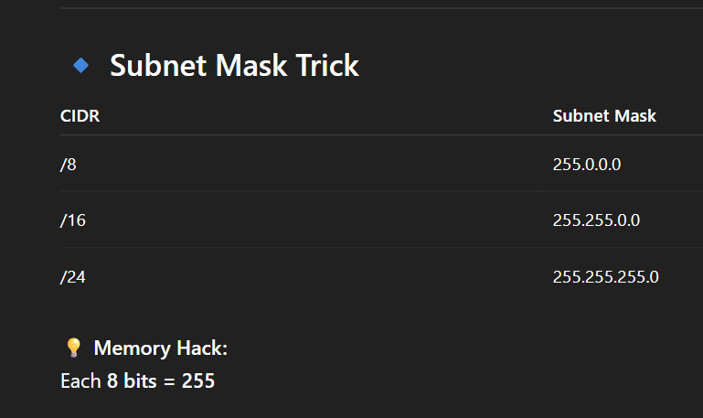

# Day 5 
#111DaysOfLearningForChange

**Today is Saturday and I am actually inspired to take a jump into a advanced concept**

**VPC Virtual Private Cloud** 

Before vpc actually we need to understand various concepts but today i skip some of them and we'll start from understanding IP and CIDR. 

* IP Address 
    >It's a unique numeric label that helps to identify devices on the internet. 
    (IPV4:32bit, IPV6:128bit)

* CIDR(Classless Inter-Domain Routing)
    > It's a method to allocate IP addresses efficiently by dividing an IP into:

    Network part + Host part 

    IP Address / Prefix
    Example: 192.168.1.0/24

    IP → starting address 
    /24 → number of bits used for network

   

   
When you create a VPC in AWS:

10.0.0.0/16

It means: This is a very large network
Can hold thousands of servers.

**Notes to Revise**

CIDR (Classless Inter-Domain Routing) is a method used to organize and allocate IP addresses efficiently. An IP address is like a unique home address for a device on a network, such as 192.168.1.10. Instead of assigning addresses randomly, networks group them, and CIDR helps define how large that group is. It uses a format like 192.168.1.0/24, where the first part is the starting network address and the number after the slash (/24) indicates the size of the network.

The number after the slash (called the prefix) tells how many addresses are reserved for the network and how many are available for devices. A smaller number like /16 means a larger network with many devices, while a larger number like /24 or /26 means a smaller network with fewer devices. For example, /24 typically allows around 254 devices. In simple terms, CIDR helps control network size, reduce IP wastage, and make networking more flexible, especially in systems like AWS where you define your own network ranges.

my subnet is has 3 times 255 which means /24 which means around 254 devices can be connected in this IP

**VPC (Virtual Private Cloud)**

A VPC is your private, isolated network inside AWS where you define and control your entire cloud environment. You decide the IP address range, create subnets, set up routing rules, and control how traffic flows in and out. By default, nothing inside a VPC is exposed to the internet unless you explicitly allow it. Think of it as your own secure virtual data center in AWS where you fully control the network layout and security boundaries.

**Public Internet (in AWS context)**

Public internet access in AWS means your resources (like an EC2 instance) are reachable from outside AWS, such as from any browser in the world. To make a resource public, it must be placed in a public subnet, assigned a public IP address, and connected to an Internet Gateway through a route table. This setup allows inbound and outbound communication with the internet. It is typically used for web servers, APIs, or applications that need to be globally accessible.

**Private Internet (Private Subnet in AWS)**

A private internet setup means resources inside a VPC are not directly accessible from the outside internet. These resources do not have public IP addresses and are placed in private subnets for security. However, they can still access the internet indirectly through a NAT Gateway, which allows outbound-only connections for updates or downloads without exposing them publicly. This is commonly used for databases, backend systems, and sensitive application components that must remain hidden from external users.