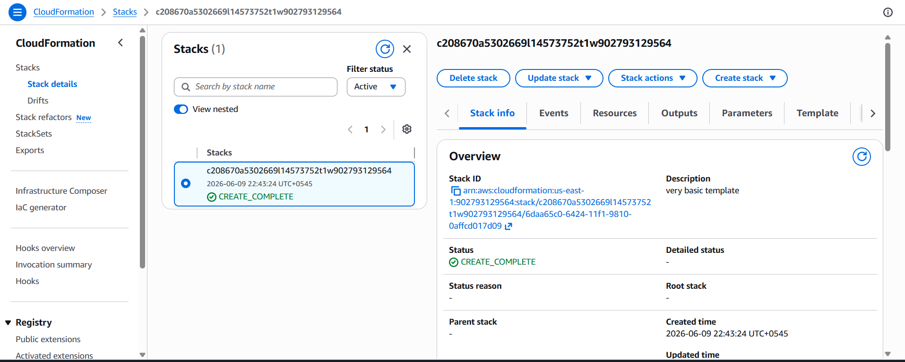
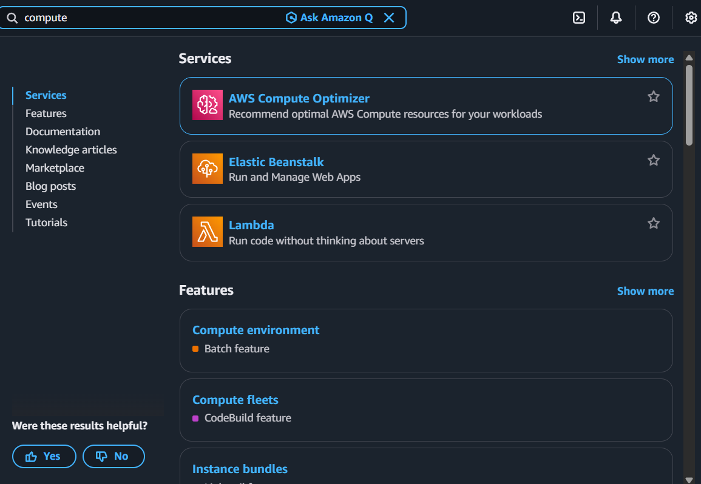
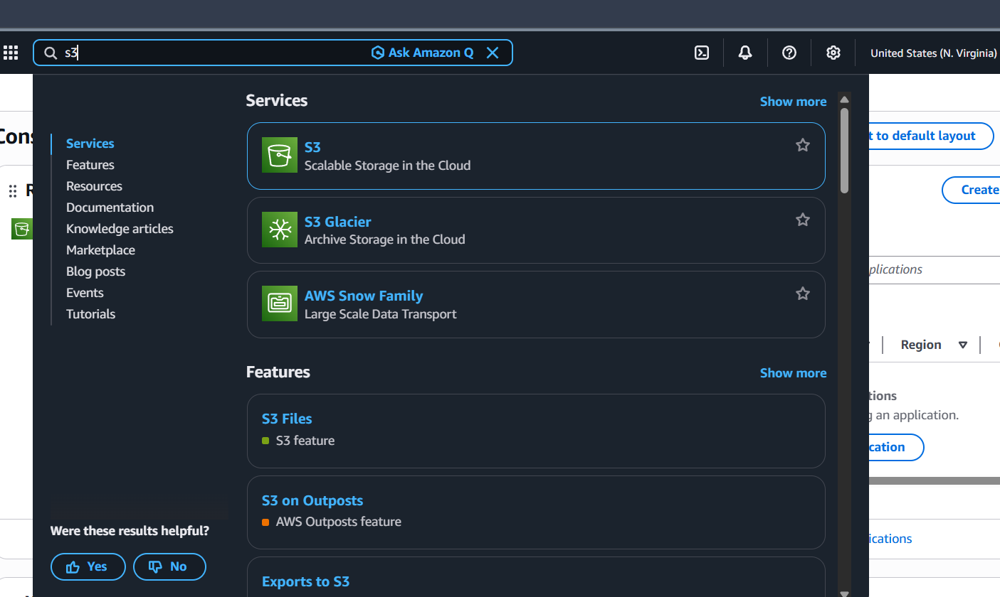
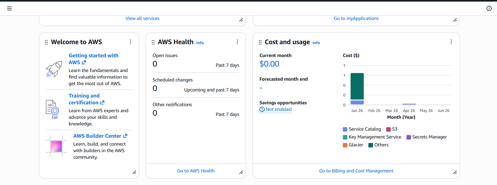

# Day 57 – Practical Knowlege of AWS

Today I explored various aws services that i have been studying till now through AWS Console. 
* Cloudformation
* Compute Optimizer 
* S3 and a lot of services 

