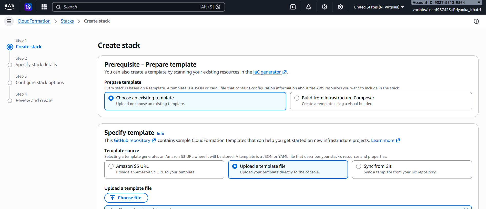

# Day 60 – Getting Started with CloudFormation (Hands-on)

Today I started learning **AWS CloudFormation** and practiced how to create and manage infrastructure using code instead of manually creating resources.


---

## Understanding CloudFormation Basics

I learned that CloudFormation is used for **Infrastructure as Code (IaC)**, which means I can define AWS resources in a template file (YAML/JSON) and AWS will create everything automatically.

Key concepts I understood:
- **Stack** = collection of resources created from a template
- Templates are written in **YAML (preferred)** or JSON
- Instead of clicking in console, we define everything in code

---

## Creating My First Template (S3 Bucket)

I practiced a beginner template where I created a simple S3 bucket using YAML:

```yaml
AWSTemplateFormatVersion: '2010-09-09'

Description: Beginner CloudFormation Template - Create an S3 Bucket

Resources:
  MyS3Bucket:
    Type: AWS::S3::Bucket

Outputs:
  BucketName:
    Description: Name of the created S3 bucket
    Value: !Ref MyS3Bucket