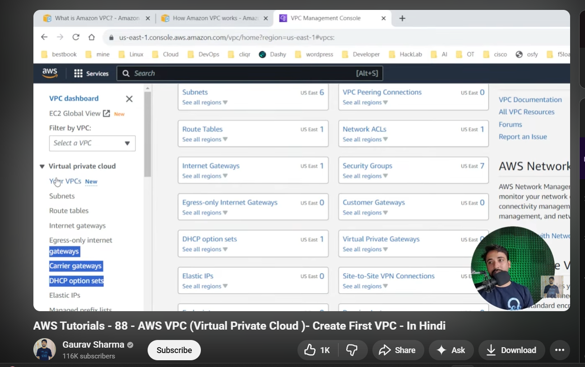
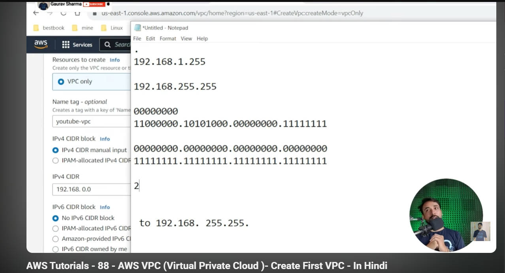

# Day 61 – Understanding VPC Basics (From Video Learning)

Today I watched a beginner-friendly video on AWS VPC and focused on understanding the core networking concepts instead of just memorizing definitions.

---

## What is a VPC (My Understanding)

I learned that a **VPC (Virtual Private Cloud)** is like creating my own private network inside AWS.

Just like in a company:
- We have a private office network
- Only authorized systems can connect

Similarly in AWS:
- VPC allows me to launch resources (like EC2)
- Everything stays isolated and secure inside my network

So basically:
> VPC = my own private data center network in the cloud

---

## VPC is Regional

One important thing I understood is:

- When I create a VPC in one region (like Mumbai)
- It does NOT exist in another region (like Virginia)

So:
> VPC is always tied to a specific AWS region

This is important when designing applications globally.

---

## CIDR Block (Very Important Concept)

I learned about CIDR notation like:

- `10.0.0.0/16`
- `192.168.1.0/24`

At first it was confusing, but the explanation made sense:

- The number after `/` defines how many bits are used for the network
- The rest is for hosts (devices)

Simple understanding:
- `/16` → large network (more IPs)
- `/24` → smaller network (fewer IPs)

Analogy:
> It’s like a phone area code + number system

---

## Creating My First VPC

I followed along and created my first VPC:

- Selected CIDR block → `10.0.0.0/16`
- Gave it a name
- Created it in a specific region

What I noticed:
- AWS quickly created my isolated network
- It becomes the base for everything (subnets, EC2, etc.)

---

## Key Learnings

- VPC is the **foundation of AWS networking**
- Everything (EC2, RDS, etc.) runs inside a VPC
- CIDR block planning is very important
- VPC is region-specific

---

## Final Thought

Today helped me understand that before launching any servers, I need to design the network first. VPC is not just a concept—it’s the starting point of building secure and scalable AWS architectures.