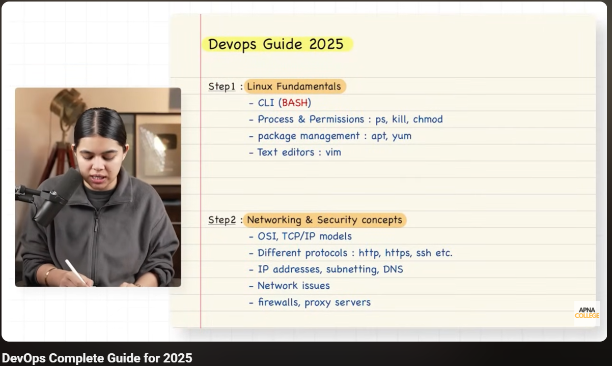

# Day 62 – Starting DevOps Journey (Roadmap Understanding)

Today I officially started my DevOps journey by understanding the roadmap and what skills are actually required to become a DevOps engineer.

## Reality About DevOps

The first thing I understood is:

> DevOps is NOT an entry-level role

It usually comes after:
- Development experience OR
- System/Cloud/Infrastructure knowledge

So it’s more like:
> A combination of multiple skills rather than a single technology

---

## Core DevOps Roadmap (My Understanding)

Instead of randomly learning tools, I now understand the proper flow:

---

## 1. Linux & Bash (Foundation)

Everything in DevOps runs on Linux servers.

I need to:
- Use terminal confidently
- Manage files, processes, permissions
- Write basic bash scripts

---

## 2. Networking & Security

This connects directly with what I learned in AWS.

Important things:
- HTTP / HTTPS
- DNS
- SSH
- IP & Ports

This helps in debugging real-world issues.

---

## 3. Programming / Scripting

DevOps is all about **automation**.

I’ll focus on:
- Python (most recommended)
- Writing scripts to automate tasks

---

## 4. Version Control (Git)

Very important skill:
- Track code changes
- Collaborate with teams
- Use GitHub

---

## 5. Cloud (Already Started with AWS)

Good thing:
I already started AWS, so this aligns perfectly.

Cloud is required because:
> Modern DevOps = Cloud-based infrastructure

---

## 6. Containers (Docker)

Instead of “it works on my machine” problems:

- Docker packages apps with dependencies
- Runs the same everywhere

---

## 7. CI/CD Pipelines

Automation of:
- Build
- Test
- Deploy

Tools:
- Jenkins (most common)

---

## 8. Infrastructure as Code

Instead of manual setup:

- Terraform → create infrastructure
- Ansible → configure systems

---

## 9. Kubernetes (Orchestration)

When apps scale:
- Manage containers
- Handle deployments, scaling, failures

---

## 10. Monitoring & Logging

To track system health:

- Prometheus → metrics
- Grafana → dashboards

---

## Advanced Concepts (Future)

After basics:
- Service Mesh (Istio)
- GitOps (ArgoCD, Flux)

---

## Key Realization

DevOps is not about tools, it’s about:
- Automation
- Collaboration
- Continuous delivery

---

## Final Thought

Today gave me clarity on the complete path. I now understand what to learn and in what order. From tomorrow, I’ll start step-by-step beginning with Linux and scripting.