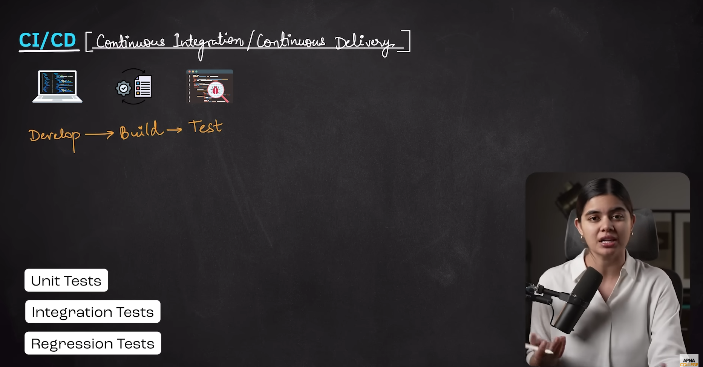
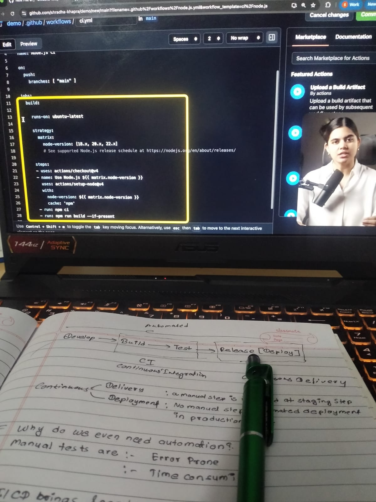

# Day 63– CI/CD Basics

## Overview

Today I learned about CI/CD and how it helps automate the software development lifecycle. It simplifies building, testing, and deploying applications in a fast and reliable way.

## What I Understood

CI/CD improves development speed and reduces errors by automating repetitive tasks. It ensures code changes are tested and deployed efficiently.

## Topics Covered

* Continuous Integration (CI)
* Continuous Delivery (CD)
* Continuous Deployment
* CI/CD Pipelines
* Automation using YAML
* Tools (GitHub Actions, Jenkins, GitLab CI/CD)
* Deployment Strategies

## Key Concepts

**Continuous Integration (CI)**
Code is frequently pushed to a repository, and automated builds and tests are triggered to catch issues early.

**Continuous Delivery**
Code is prepared for release automatically, but deployment may require manual approval.

**Continuous Deployment**
Fully automated process where code changes are directly deployed to production without manual steps.

## Deployment Strategies

* Blue-Green Deployment
* Canary Deployment
* Rolling Deployment

## Summary

CI/CD is an essential DevOps practice that enables faster, reliable, and automated software delivery while reducing manual effort and risks.
