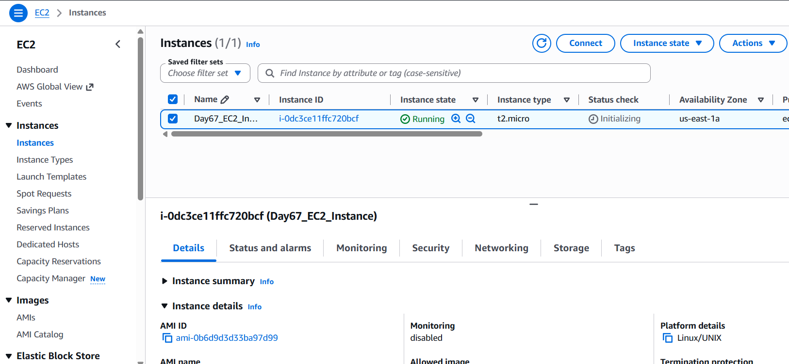
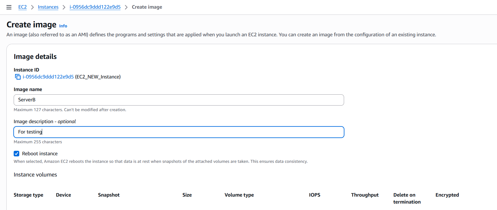

# Day 67 - Creating an AWS EC2 Instance and Cloning My Project

Today, I worked on deploying my project infrastructure to the cloud using AWS EC2.

I created a new Ubuntu EC2 instance, configured the required access settings, and connected to it remotely using SSH. Once connected, I verified that the instance was running correctly and accessible from my local machine.

After gaining access to the server, I cloned my project repository onto the EC2 instance. This allowed me to move the project environment from my local system to a cloud-based machine, which is an important step toward deployment and production-ready infrastructure.

During the process, I also reviewed key AWS concepts such as public and private IP addresses, security groups, and remote server access. Working directly with a cloud-hosted Linux machine provided a better understanding of how applications are deployed and managed outside a local development environment.

## What I Accomplished

* Created a new AWS EC2 instance.
* Connected to the instance using SSH.
* Verified successful remote access to the server.
* Cloned my project repository onto the EC2 instance.
* Explored AWS networking and instance management.
* Continued building hands-on cloud deployment experience.

