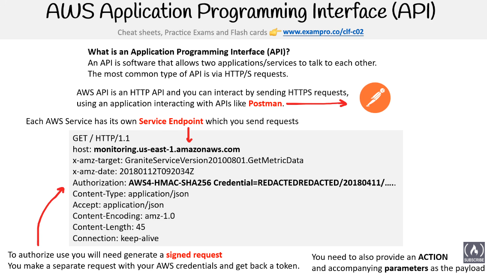

# Day 68 – Understanding AWS API Basics

## Overview

Today I started learning about AWS APIs from the very basics. It helped me understand what actually happens behind the scenes when I use the AWS console or CLI.

## My Understanding

I realized that every action I perform in AWS, like creating an EC2 instance or an S3 bucket, is actually an API call in the background. The console is just a visual layer on top of these APIs.

## What I Learned

An API is a way for two systems to communicate with each other using HTTP requests. AWS provides APIs for every service, and these APIs allow me to interact with cloud resources programmatically.

## Key Concepts

**Endpoints**
Each AWS service has a specific URL where requests are sent. Some endpoints are regional, while some are global depending on the service.

**Authentication and Signing**
I cannot just send a request. Every API call must be authenticated using access keys and a signature. This ensures the request is secure and verified.

**Actions and Parameters**
Every API call includes an action, like describing EC2 instances, and parameters that define additional details for that action.

## Ways to Use AWS API

I understood that directly calling APIs is complex, so we use tools built on top of them:

* AWS Management Console for GUI based interaction
* AWS CLI for command line usage
* AWS SDKs for using AWS in programming languages

## Documentation

AWS documentation is the main place to learn APIs. Each service provides a user guide for understanding concepts and an API reference for technical details.

## Realization

Earlier I thought the console was the main way to use AWS, but now I understand that everything is driven by APIs. Learning this gives me a deeper understanding of how automation and DevOps workflows actually work.

## Summary

Today I learned the foundation of AWS APIs and how all tools interact with AWS services through them. This concept connects strongly with automation and infrastructure management.
