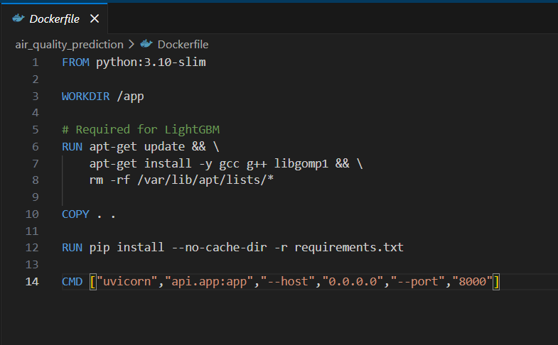
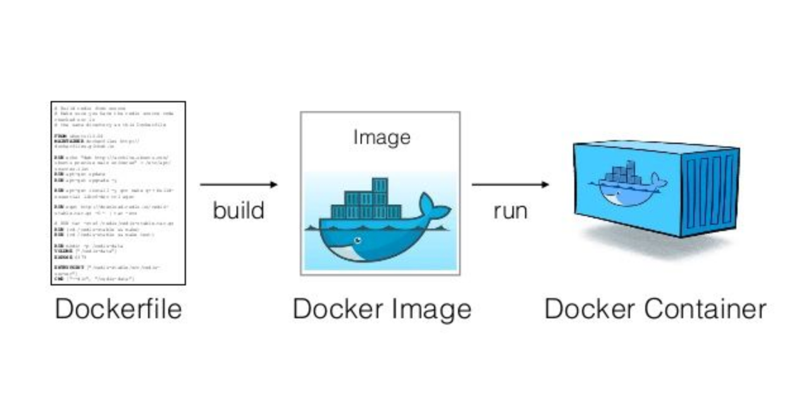

# Day 73 – Building My First Docker Image

## Overview

Today felt like a real step forward because I moved from just using Docker images to actually creating one on my own. Until now, I was pulling images from Docker Hub, but today I understood how those images are built.

## My Understanding

I learned that Docker images are created using something called a Dockerfile. It is basically a set of instructions that tells Docker how to build an image step by step. This made me realize that Docker is not just about running containers, but also about packaging applications properly.

## What I Did

I created a simple Dockerfile for a basic application. I defined the base image, added my application code, and specified how the container should run. Then I built the image using the docker build command and ran it as a container.

## Key Concepts

Dockerfile
A text file that contains instructions to build a Docker image. Each line represents a step in the image creation process.

Base Image
The starting point of any Docker image. It can be something lightweight like alpine or a full environment like ubuntu.

Image Build Process
Docker reads the Dockerfile step by step and creates layers. These layers help in caching and make builds faster.

Port Mapping
I understood how to expose my application running inside the container to my local machine.

## Commands I Practiced

docker build
docker run with port mapping
docker images

## Realization

This was one of the most important learnings so far. I finally understood how developers package their applications and make them portable. It gave me confidence that I can now create and share my own environments.

## Summary

Today I built my first Docker image using a Dockerfile and ran it as a container. This helped me understand how applications are packaged and deployed using Docker in real world scenarios.
