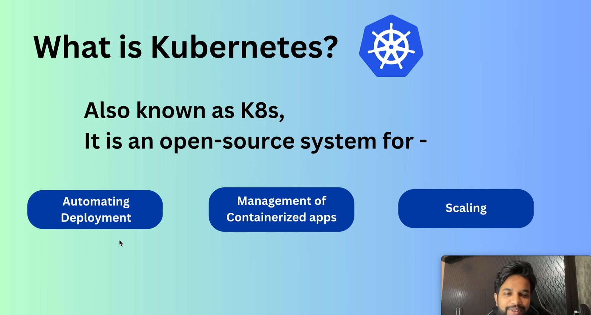
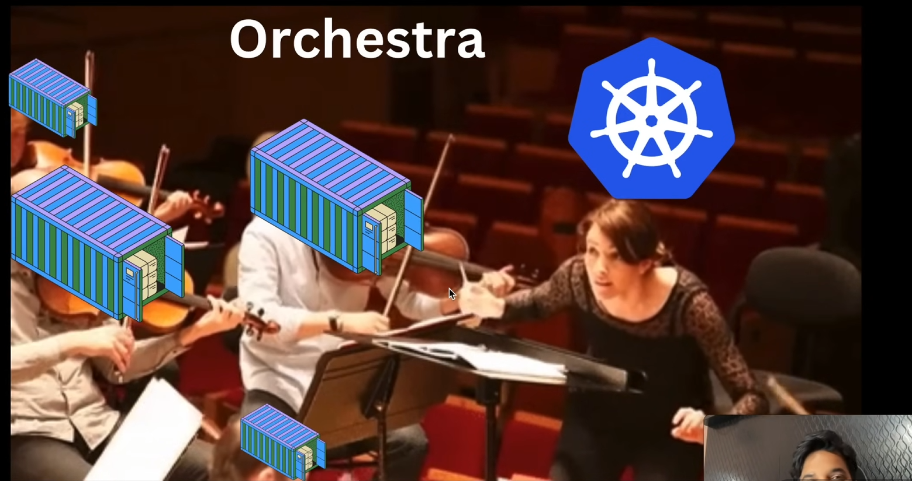
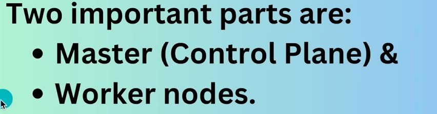
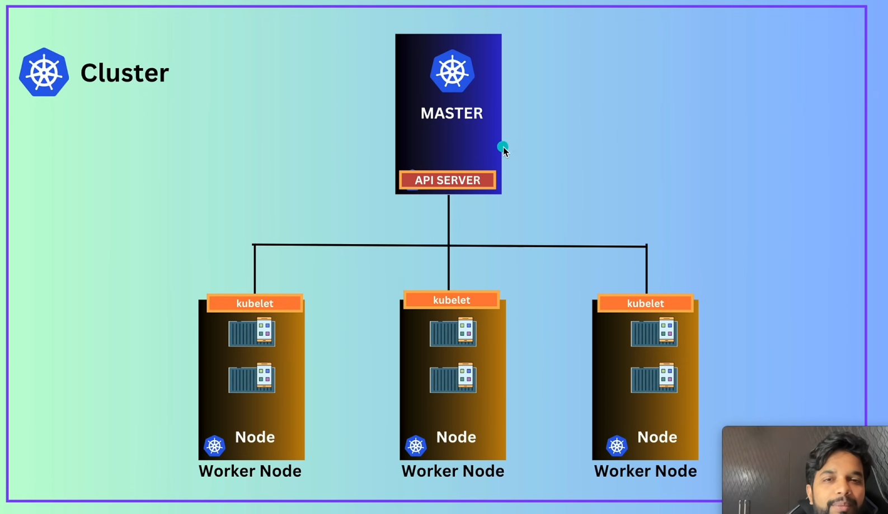
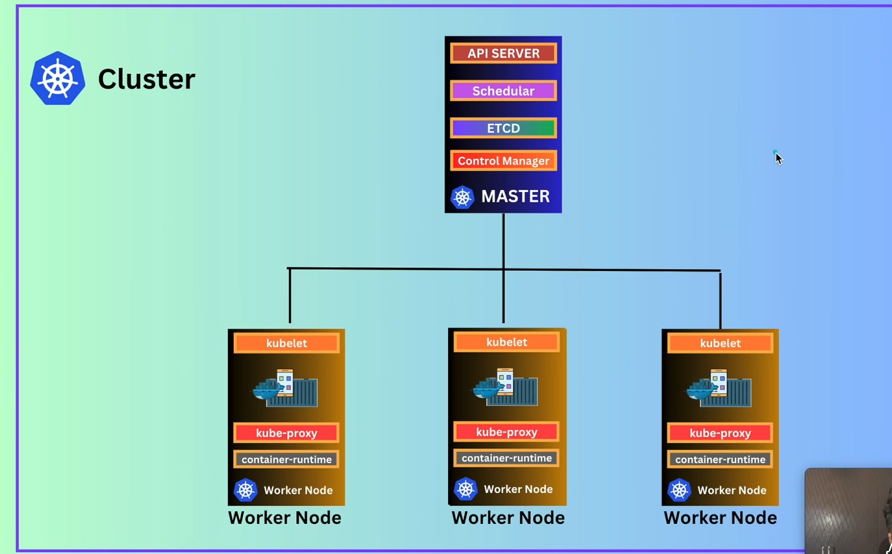
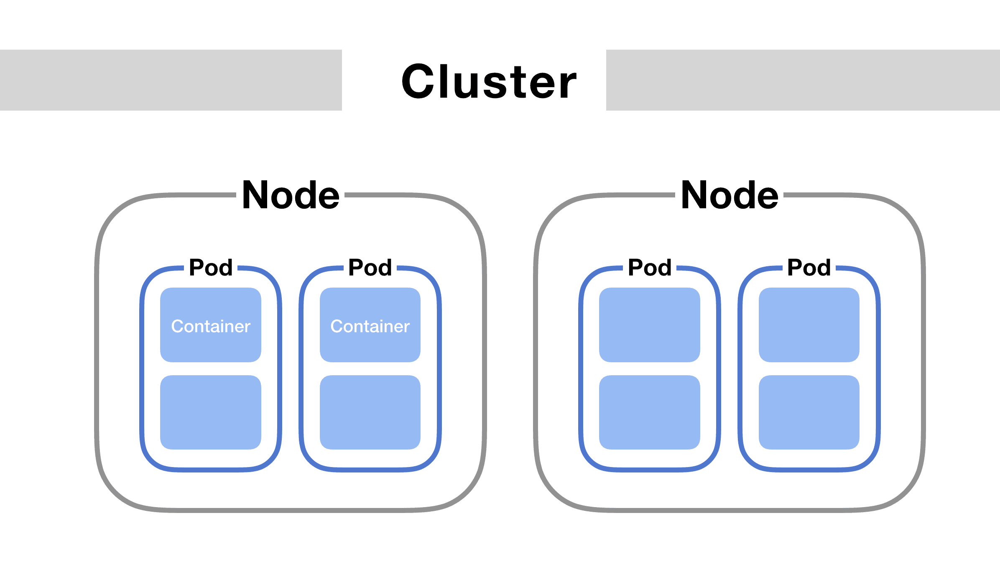

# Day 77 – Beginning Kubernetes

# What I learned? 
I get to Learn about kubernetes in while studying about AWS but now it's time to going deep down into it. 

When Containerized services can provides with benefits and when the no of containers increase there is a need of system that monitors the containers, that's when Kubernetes solves this problem.

# CLUSTER 
Cluster is the environment we get when we deploy and set up Kubernetes on our infrastucture. It acts as a single entity that manages our containers.

The key component of the clusters are: 
* Master(or Control Panel): This is the "orchestrator" that manages the entire state of the cluster.

* Nodes/infrasturcture: The servers or machines that run your containerized applications

<!--  -->

# Different Components of Kubernetes
* API SERVER
* Container Runtime
* Scheduler
* Kube controller
* Kube Proxy 
* Kubelet 
* ETCD

# What is Pod? 
We need Pods in Kubernetes because they serve as the smallest deployable unit of execution, acting as a crucial abstraction layer over raw containers. While platforms like Docker manage individual containers, Kubernetes manages Pods. This architectural choice resolves fundamental networking, storage, and architectural limitations of running multi-container applications at scale.

