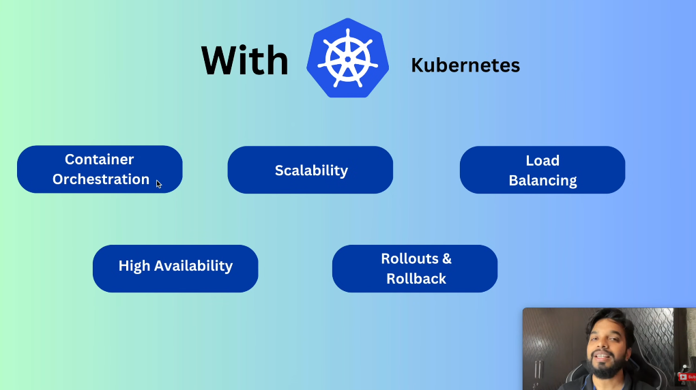
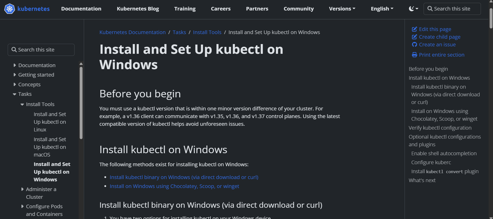
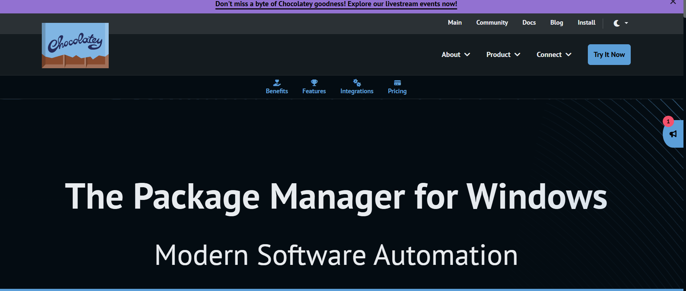

# Day 77 – Day2 Kubernetes

## MASTER NODE 
### API SERVER

The Kubernetes API server (kube-apiserver) is the central administrative hub and front door of a Kubernetes cluster's control plane. It exposes a RESTful HTTP API that allows users (via tools like kubectl), internal cluster components (like the scheduler and controller manager), and external services to communicate and manage the state of cluster resources.

### SCHEDULER 
Assign nodes to newly created pods. 

### ETCD 
key-value store, having all clustered data. 

### Control Manager 
responsible for the managing the state of the cluster 

## Worker Node 

### Kubelete: 
Agent make sure containers  running in the pods 

### Kube-proxy 
maintains network rules for communication with pods.

## Container Runtime 
A tool responsible for running containers 

> What can we achieve using kubernetes? 

# Downloading Kubernetes for Windows 

# Downloading Chocolatey 

That's all for today............. 