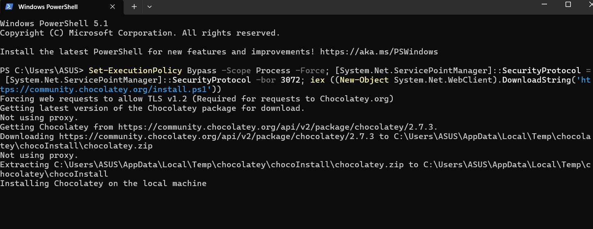
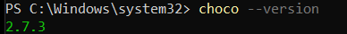
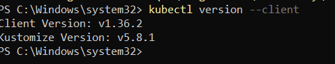
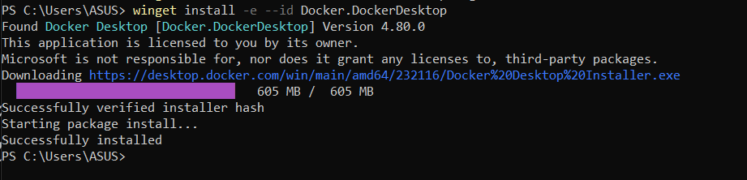
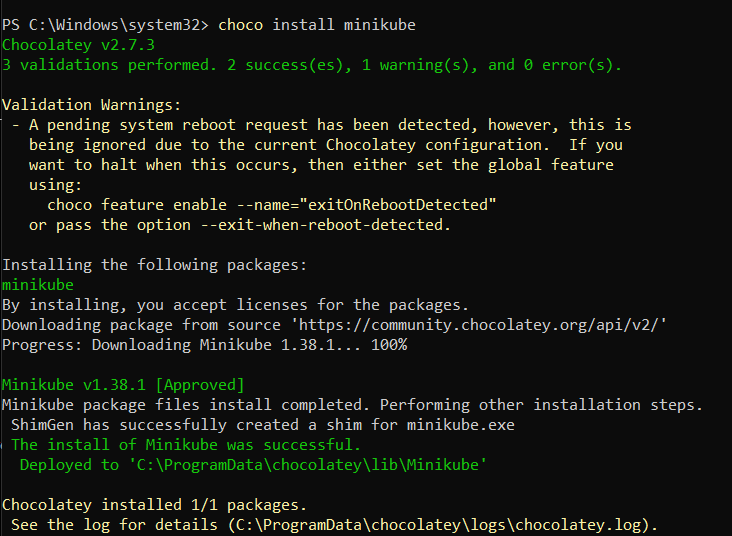
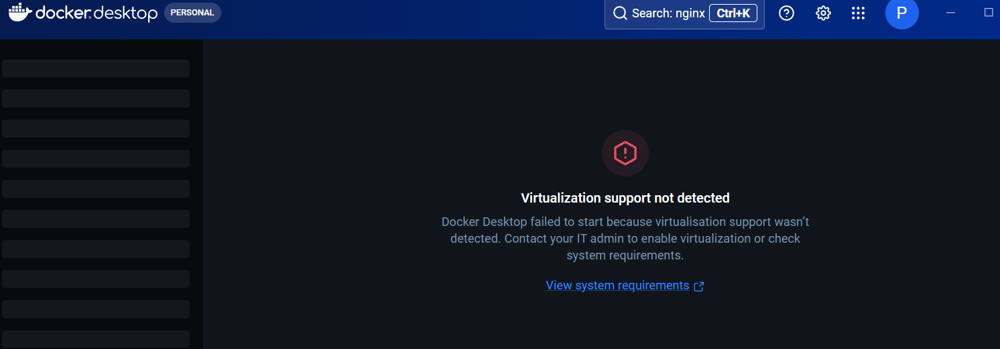

# Day 79 – Day3 Kubernetes
Today, is the time to run chocoloate Kubernetes. For this I have to go through the following process. 

I have worked with docker in linux but I haven't worked in windows so it's time to install docker as well. 

* Installing Docker 

* Installing choco minikube 

* making the Kubernetes cluster using minicube 

I ran into a major issue with WSL today, which also prevented Docker from working properly. Because of that, I wasn't able to continue with the setup. I'll start tomorrow by troubleshooting the WSL/Docker issue first and then continue from there. That's all for today.